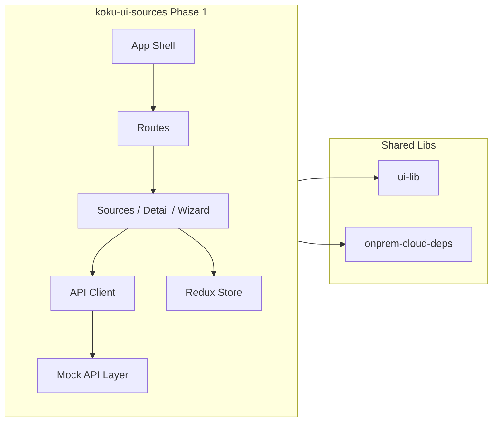

# Phase 1: koku-ui-sources app and sources-ui migration

## Goals

- New app: **koku-ui-sources** at [Insights-org/koku-ui/apps/koku-ui-sources](Insights-org/koku-ui/apps/koku-ui-sources).
- **Migrate** sources-ui functionality into this app while adopting koku-ui-onprem standards: TypeScript (add a step for typing, linting and prettier), PatternFly 6, same coding style and build approach.
- **Standalone** for Phase 1 (own dev server); prepared for Phase 2 integration as a micro frontend (no Module Federation in Phase 1).
- **On-prem only**: no cloud-only APIs (e.g. HCS), no console.redhat.com; use [libs/onprem-cloud-deps](Insights-org/koku-ui/libs/onprem-cloud-deps) for Chrome/Unleash stubs.
- **Mock data** for all APIs required by the UI so the app runs without a real backend.

---

## 1. App scaffold (mirror koku-ui-onprem)

- **Create** `apps/koku-ui-sources/` with the same structure as koku-ui-onprem:
  - [package.json](Insights-org/koku-ui/apps/koku-ui-onprem/package.json): name `@koku-ui/koku-ui-sources`, same React/PatternFly/React Router/Redux/TypeScript versions; add `react-intl` and any deps needed for forms (e.g. data-driven-forms if kept). Omit Scalprum and Module Federation for Phase 1.
  - **Webpack**: Copy and adapt [webpack.config.ts](Insights-org/koku-ui/apps/koku-ui-onprem/webpack.config.ts): entry `./src/index.tsx`, dev server on a **different port** (e.g. **9010**) to run alongside onprem, same loaders (ts, css, sass, assets), resolve aliases for `@koku-ui/ui-lib` and `@koku-ui/onprem-cloud-deps`. No `static` entries for remotes; no ModuleFederationPlugin. Optional: proxy `/api/sources/v3.1` and `/api/cost-management/v1` to a mock server or handle mocks in-app (see below).
  - **TypeScript**: [tsconfig.json](Insights-org/koku-ui/apps/koku-ui-onprem/tsconfig.json) extending root, `baseUrl: "./src"`, same path aliases for libs.
  - **Entry**: `src/index.html`, `src/bootstrap.tsx` (PatternFly base CSS + createRoot → App), `src/index.tsx` (dynamic import of bootstrap).
  - **App shell**: Minimal layout (e.g. PatternFly `Page`, `Masthead`, `PageSection`) with `BrowserRouter` and a single content area for routes (no sidebar nav for Phase 1). Use **functional components** and **TypeScript** throughout.
- **Root workspace**: No change to [package.json](Insights-org/koku-ui/package.json) `workspaces` (already `./apps/*`). Add optional script: `"start:sources": "npm run -w @koku-ui/koku-ui-sources start"` for convenience.

---

## 2. Shared libs and on-prem stubs

- **Use** [libs/ui-lib](Insights-org/koku-ui/libs/ui-lib) (e.g. NotFound, UiVersion) where applicable.
- **Use** [libs/onprem-cloud-deps](Insights-org/koku-ui/libs/onprem-cloud-deps):
  - **useChrome**: Current stub has `updateDocumentTitle`, `auth.getUser`. DataLoader and PermissionsChecker also need `auth.getToken` (resolve with a dummy token) and `getUserPermissions` (resolve with empty array). **Extend** [useChrome.ts](Insights-org/koku-ui/libs/onprem-cloud-deps/src/frontend-components/useChrome.ts) with `getToken: async () => ''`, `getUserPermissions: async () => []`, and `isProd: () => false` so sources app works without cloud.
  - **Unleash**: sources-ui uses `useFlag('platform.integrations.hcs-disable')`. Add a **useFlag** export to onprem-cloud-deps (e.g. `useFlag: () => () => false`) so feature flags are disabled on-prem; keep existing `useUnleashClient` for compatibility.
  - **Notifications**: Use existing NotificationsProvider/notification hooks from onprem-cloud-deps in the new app instead of `@redhat-cloud-services/frontend-components-notifications`.
- **Aliases**: In koku-ui-sources webpack and tsconfig, map `@redhat-cloud-services/frontend-components` and `@redhat-cloud-services/frontend-components-notifications` to onprem-cloud-deps, and `@unleash/proxy-client-react` to onprem-cloud-deps unleash stub, so no cloud packages are imported.

---

## 3. Mock API layer

Provide **in-app mocks** for all endpoints the UI calls, so the app runs standalone without a backend.

**Sources API** (`/api/sources/v3.1`):

- **GraphQL** (POST `.../graphql`): Mock responses for:
  - `doLoadEntities`: paginated list with `sources` (array matching `graphQlAttributes`: id, created_at, source_type_id, name, availability_status, applications, endpoints, authentications, etc.) and `meta.count`. Reuse/extend shapes from sources-ui test mocks (sourcesData.js, sourceTypes.js).
  - **Conditional filter**: Parse `filter` with `name` (filter column) and `value` (filter value). Support columns: `name`, `source_type_id`, `applications`, `availability_status`. Filter the list before pagination: **name** — substring (case-insensitive); **source_type_id** — exact match (empty value = no filter); **applications** — match by application type display_name (e.g. via mockApplicationTypes); **availability_status** — normalized status (available / unavailable / partially available / paused) substring. Do not import `mockSourceTypes` in graphql mock if only exact `source_type_id` match is used.
  - `doLoadSource`: single source by id.
  - `doLoadApplicationsForEdit`: applications for a source.
- **REST**: Mock GET/POST/PATCH/DELETE for:
  - `sources`, `sources/:id`, `sources/:id/check_availability`, `sources/:id/pause`, `sources/:id/unpause`, `sources/:id/endpoints`, `sources/:id/applications`, `sources/:id/authentications`;
  - `endpoints`, `endpoints/:id`, `endpoints/:id/authentications`;
  - `authentications`, `authentications/:id`;
  - `applications`, `applications/:id`, `applications/:id/pause`, `applications/:id/unpause`;
  - `application_authentications` (POST);
  - `source_types` (GET): return list (on-prem: OpenShift, Ansible Tower, Satellite; optionally AWS/Azure/GCP for cost if needed);
  - `application_types` (GET);
  - `bulk_create` (POST);
  - `app_meta_data` (GET): return empty or minimal for on-prem (no AWS/GCP/Azure provisioning metadata required for Phase 1).

**Cost Management API** (`/api/cost-management/v1`):

- **GET** `sources/aws-s3-regions/`: return mock list of regions (e.g. `[{ value: 'us-east-1', label: 'US East (N. Virginia)' }, ...]`) for add-source wizard if that step is kept; otherwise minimal array.

**Excluded / stubbed (on-prem)**:

- **HCS enrollment**: Do not call console.redhat.com. In Redux, `loadHcsEnrollment` should resolve with `false` or no-op when using mock or on-prem mode.
- **Integrations** (`/api/integrations/v1.0/endpoints`): optional; mock with empty array if the widget or any UI calls it.
- **Marketplace**: not required for on-prem Phase 1; mock empty or omit.

**Implementation options**:

- **Option A (recommended)**: **Axios interceptors** in the sources app that, when `USE_MOCK_API=true` (or always in dev), intercept requests to `/api/sources/v3.1` and `/api/cost-management/v1` and return mock data from static JSON/TS modules. This keeps the same API client interface as sources-ui.
- **Option B**: **MSW (Mock Service Worker)** in the app with handlers for the same URLs and response shapes.
- **Option C**: Small **Express (or similar) mock server** served by webpack devServer `setupMiddlewares`/proxy and JSON files; more setup, same outcome.

Define **TypeScript interfaces** for source, source type, application type, endpoint, authentication, and GraphQL response shapes (aligned with sources-ui entities.js and test mocks) and use them in both mock layer and UI.

---

## 4. Migration of sources-ui functionality

**Routes** (from sources-ui routes.ts and Routing.js):

- `/` — Sources list
- `/new` — Add source wizard
- `/remove/:id` — Remove source modal
- `/detail/:id` — Source detail
- `/detail/:id/rename`, `/detail/:id/remove`, `/detail/:id/add_app/:app_type_id`, `/detail/:id/remove_app/:app_id`, `/detail/:id/edit_credentials` — Detail sub-routes

**Pages and components to migrate** (convert to TypeScript and PatternFly where applicable):

- **Pages**: Sources (list + toolbar), Detail.
- **Key components**: SourcesTable (with loaders), addSourceWizard, SourceRemoveModal, SourceRenameModal, AddApplication, RemoveAppModal, CredentialsForm, DataLoader, PermissionsChecker, ErrorBoundary.
- **State**: Redux store (sources, user/permissions). Keep similar reducer/action structure; typesafe-actions and TypeScript types for actions and state.
- **i18n**: Keep react-intl; use same pattern as koku-ui-onprem (messages under `src/locales` or similar).

**Sources list toolbar — conditional filter and Type selector** (implemented):

- **Conditional filter**: Toolbar includes a filter with (1) a **column dropdown** (PatternFly Select + MenuToggle) to choose filter by **Name**, **Type**, **Application**, or **Status**, and (2) a **value control** that depends on the selected column.
- **Redux**: Store `filterValue` with `filterColumn` (`name` | `source_type_id` | `applications` | `availability_status`) and the corresponding value key (`name`, `source_type_id`, `applications`, `availability_status`). Action `filterSources({ filterColumn, [column]: value })`; reducer updates filter state and triggers load (or load reads filter from state).
- **Name / Application / Status**: Use a single **text input** with debounce (e.g. 300 ms). Placeholder and aria-label reflect the selected column (e.g. "Filter by type"). On change, dispatch `filterSources` with the typed value.
- **Type column**: When **Type** is selected, **replace the text input with a single-select dropdown**. Options must be **only the source types that exist in the current table data**: derive unique `source_type_id` from the current `entities` list, map each to its label via `sourceTypesList` (product_name / name). Do **not** use the full source types catalog (e.g. mockSourceTypes); only types present in the list. Include an **"Any type"** option (value `''`) to clear the type filter. Selecting a type applies the filter immediately (no debounce).
- **API**: In `api/entities.ts`, `conditionalFilter(filterValue)` builds the GraphQL filter object (e.g. `name`, `operation: "contains"`, `value` for text columns; for `source_type_id` use the stored id and exact match where backend supports it).
- **Switching column**: When the user switches the filter column to Type, clear the type filter (set `source_type_id: ''`). When switching away from Type, keep the existing text input behavior for the new column.

**On-prem simplifications**:

- **CloudCards** ("I connected to cloud. Now what?"): Remove for on-prem.
- **HCS**: Never call HCS API; DataLoader and add-source flow should not depend on HCS enrollment.
- **Cost / provisioning**: Include all add-source wizard steps. For cloud-specific screens (e.g. GCP/Azure provisioning, Lighthouse, AWS regions), mock the screens and show a visible label on those screens indicating "cloud" so the wizard still completes with mock data.
- **Sentry**: Use a stub for Phase 1; full implementation in Phase 2.
- **External links** (docs, marketplace): Do not reuse cloud docs; create updated on-prem documentation where needed.

**Coding standards** (align with koku-ui-onprem and user rules):

- Functional components, TypeScript interfaces, named exports.
- PatternFly 6 components for layout, tables, forms, modals, buttons (replace any legacy PF4 or custom components).
- Prefer context/reducers over excessive useState/useEffect; memoize where appropriate.
- Lowercase-with-dashes for directories; strict TypeScript.

---

## 5. File and folder layout (suggested)

```
apps/koku-ui-sources/
├── package.json
├── tsconfig.json
├── webpack.config.ts
├── src/
│   ├── index.html
│   ├── index.tsx
│   ├── bootstrap.tsx
│   ├── components/
│   │   ├── App/
│   │   │   ├── App.tsx
│   │   │   └── AppLayout.tsx
│   │   ├── DataLoader.tsx
│   │   ├── ErrorBoundary.tsx
│   │   ├── PermissionsChecker.tsx
│   │   ├── addSourceWizard/     (or add-source-wizard)
│   │   ├── SourcesTable/
│   │   ├── SourceRemoveModal/
│   │   ├── SourceDetail/
│   │   ├── AddApplication/
│   │   ├── CredentialsForm/
│   │   └── ...
│   ├── pages/
│   │   ├── Sources.tsx
│   │   └── Detail.tsx
│   ├── routes.ts
│   ├── api/
│   │   ├── constants.ts
│   │   ├── entities.ts          (API client; same interface, backed by mocks when enabled)
│   │   └── mock/               (mock handlers and data)
│   │       ├── sources.ts
│   │       ├── sourceTypes.ts
│   │       ├── applicationTypes.ts
│   │       ├── graphql.ts
│   │       └── cost.ts
│   ├── redux/
│   ├── utilities/
│   └── locales/
```

---

## 6. Phase 2 readiness

- **No Module Federation** in Phase 1: app is a standalone SPA. Structure the entry and root component so that in Phase 2:
  - The same routes and components can be mounted under a base path (e.g. `/sources`) when loaded by koku-ui-onprem.
  - Redux can be optionally provided by the host or remain local.
- **Public path**: Use webpack `output.publicPath: '/'` for now; Phase 2 can set it to the remote's public path.
- **Shared dependencies**: Use the same React/React-DOM/PatternFly versions as koku-ui-onprem to simplify future federation.

---

## 7. Verification

- Run `npm run -w @koku-ui/koku-ui-sources start` and open the app (e.g. http://localhost:9010).
- Confirm: source types and application types load; sources list (mock) and pagination work; **conditional filter** (Name / Type / Application / Status) works—text input for Name, Application, Status (debounced), and **Type** shows a dropdown of only the types present in the current list (plus "Any type"), with exact-match filtering; detail page and modals (remove, rename, add/remove app, edit credentials) work with mock data; add source wizard completes for at least one source type (e.g. OpenShift or Ansible Tower).
- Lint and TypeScript pass; no direct imports from `@redhat-cloud-services/*` or `@unleash/proxy-client-react` (only via aliases to onprem-cloud-deps).

---

## 8. Testing

Add and adjust tests from sources-ui so that koku-ui-sources has equivalent coverage for migrated code, using the same testing stack as the rest of koku-ui (Jest, React Testing Library).

### Approach

- **Stack**: Jest (root or app-level config), `@testing-library/react`, `@testing-library/jest-dom`, `@testing-library/user-event`. Use TypeScript for test files (`.test.ts` / `.test.tsx`).
- **Scope**: Focus on units that exist in koku-ui-sources: routes, urlQuery utilities, Redux (sources + user reducers and actions), API layer (entities + mock), and key components/pages as they are migrated.
- **Adjustments from sources-ui**:
  - **Routes**: Port `routes.test.js` → `routes.test.ts`; test `replaceRouteId` and route paths (paths in koku-ui-sources use `detail/:id` etc.).
  - **Utilities**: Port `urlQuery.test.js` → `urlQuery.test.ts`; align with koku-ui-sources’ `parseQuery` (which uses `page`, `perPage`, `sortBy`, `sortDirection`, `activeCategory` from URLSearchParams). Export a pure `parseQueryFromSearch(search: string)` for testability (no `window.location` mocking). Omit or simplify tests for `updateQuery` and any enhanced attributes not yet implemented.
  - **Redux**: Port `redux/sources/reducer.test.js` and `redux/sources/actions.test.js` → TypeScript; test the default reducer export with dispatched actions (sources reducer in koku-ui-sources does not export individual handlers). Port only actions that exist in koku-ui-sources (e.g. `loadSourceTypes`, `loadAppTypes`, `loadHcsEnrollment`, `loadEntities`, `setCategory`). Mock `api/entities` and optionally `@koku-ui/onprem-cloud-deps` where needed. Port `redux/user/reducer.test.js` and `redux/user/actions.test.js` similarly.
  - **API / mock**: Add tests for `api/entities` (e.g. `doLoadEntities`, `doLoadSource`, `getSourcesApi` with mock) and for `api/mock/graphql.ts` response shapes so mock data stays aligned with UI expectations.
  - **Components/Pages**: As components are migrated, add or port tests (e.g. Sources page table, Detail page, DataLoader, ErrorBoundary). Use React Testing Library; wrap with `Provider` (Redux), `Router`, and any Intl/notification providers as in the app.
- **Not ported in Phase 1**: Tests that depend on cloud-only code (HCS, console.redhat.com, full add-source wizard schema, CloudCards), or on components not yet migrated (e.g. SourceEditModal, CredentialsForm). Add placeholders or skip with a comment referring to Phase 2.
- **Location**: Tests live next to source (e.g. `src/routes.test.ts`, `src/utilities/urlQuery.test.ts`, `src/redux/sources/reducer.test.ts`) or under `src/test/` mirroring sources-ui structure; use the same convention as the rest of koku-ui (e.g. `*.test.ts(x)`).
- **CI**: Ensure `npm run test` (or `npm run -w @koku-ui/koku-ui-sources test`) runs in the repo and passes.

### Test file mapping (sources-ui → koku-ui-sources)

| sources-ui                               | koku-ui-sources                                                    |
| ---------------------------------------- | ------------------------------------------------------------------ |
| `src/test/routes.test.js`                | `src/routes.test.ts`                                               |
| `src/test/utilities/urlQuery.test.js`    | `src/utilities/urlQuery.test.ts` (simplified)                      |
| `src/test/redux/sources/reducer.test.js` | `src/redux/sources/reducer.test.ts`                                |
| `src/test/redux/sources/actions.test.js` | `src/redux/sources/actions.test.ts` (subset)                       |
| `src/test/redux/user/reducer.test.js`    | `src/redux/user/reducer.test.ts`                                   |
| `src/test/redux/user/actions.test.js`    | `src/redux/user/actions.test.ts` (subset)                          |
| —                                        | `src/api/entities.test.ts` or `src/api/mock/graphql.test.ts` (new) |

---

## Summary diagram


